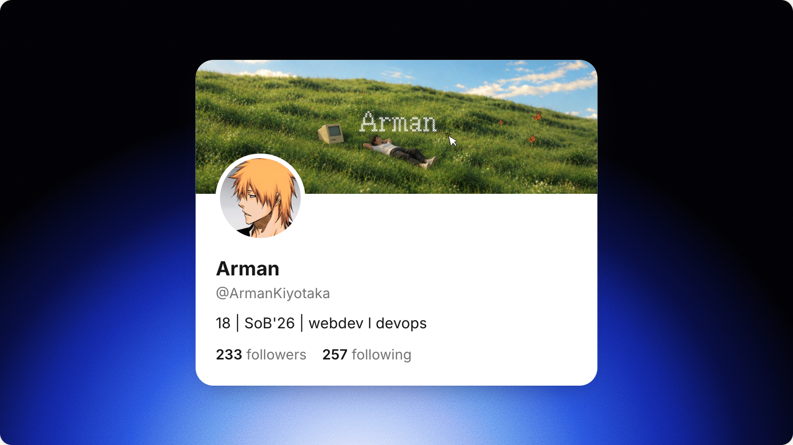
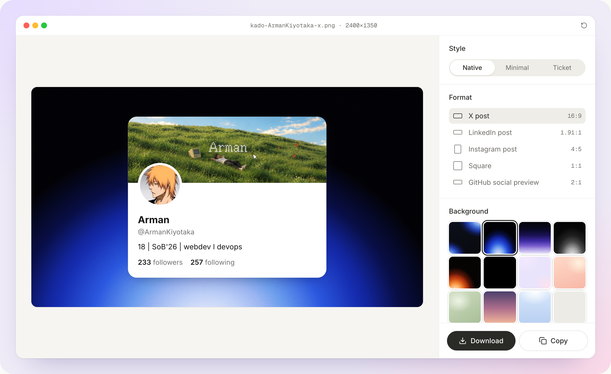
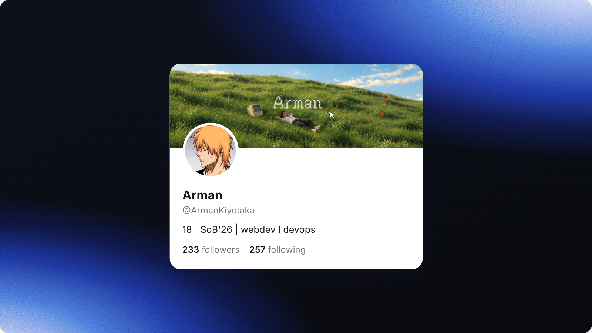
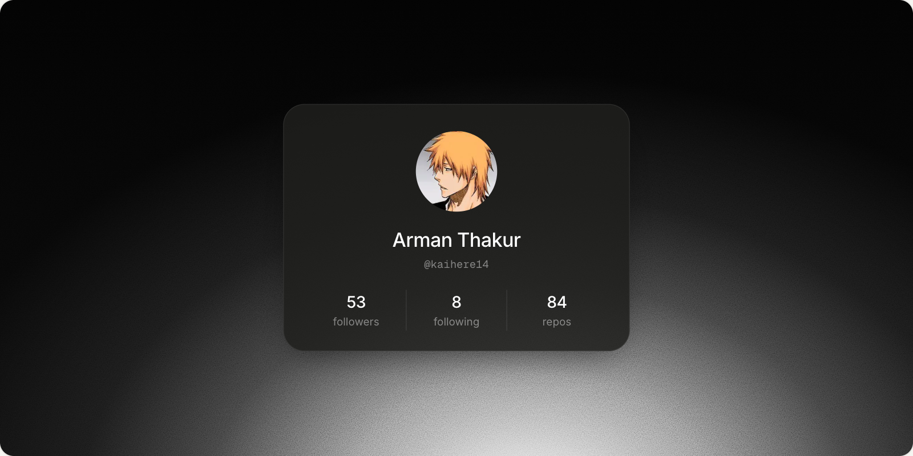
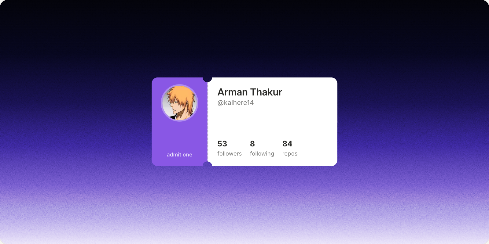

<p align="center">
  
</p>

<p align="center">
  Turn an X, GitHub or Instagram handle into a profile card worth posting.<br>
  No sign-up, no design tool, nothing stored.
</p>

<h4 align="center">
  <a href="#getting-started">Getting started</a> |
  <a href="#usage">Usage</a> |
  <a href="#how-it-works">How it works</a> |
  <a href="#roadmap">Roadmap</a>
</h4>

<p align="center">
  
  
  
  
  <a href="LICENSE"></a>
  
</p>

kado makes a clean, share-ready image of your profile. Type a handle, and it pulls your name, bio, photo, banner and follower counts, sets them on a card in the style of the platform, and places the card on a background sized for the feed you're posting to. Download it as a PNG or copy it straight to the clipboard.

<p align="center">
  
</p>

## Highlights

| | |
|---|---|
| Platforms | X, GitHub and Instagram pulled automatically; LinkedIn filled in by hand |
| Card styles | Native, Minimal and Ticket, each in light or dark |
| Export sizes | X post 16:9, LinkedIn 1.91:1, Instagram 4:5, Square 1:1, GitHub social preview 2:1 |
| Resolution | Every export at 2×, for example 2400 × 1350 for an X post |
| Backgrounds | Five grainy gradients, plain black, six soft tones, or your own image |
| Accounts | None. Nothing is saved on a server |

## Card styles

<table>
  <tr>
    <td width="33%"></td>
    <td width="33%"></td>
    <td width="33%"></td>
  </tr>
  <tr>
    <td align="center"><b>Native</b><br><sub>Reads like the platform's own profile header</sub></td>
    <td align="center"><b>Minimal</b><br><sub>Centered and quiet, one row of numbers</sub></td>
    <td align="center"><b>Ticket</b><br><sub>An admission ticket with a perforated stub</sub></td>
  </tr>
</table>

## Getting started

kado needs Node.js 20 or newer and [pnpm](https://pnpm.io).

```sh
git clone https://github.com/kaihere14/Kado && cd Kado
pnpm install
pnpm dev
```

Open [localhost:3000](http://localhost:3000). No keys are required.

GitHub allows 60 unauthenticated requests an hour. To raise that to 5,000, add a personal access token with no scopes to `.env.local`:

```sh
GITHUB_TOKEN=github_pat_...
```

To build for production, run `pnpm build` and then `pnpm start`. kado runs on any host that supports Next.js, including Vercel.

## Usage

1. Choose a platform and type a handle. Full profile URLs and a leading `@` work too.
2. Pick a **style**, a **format** for where you're posting, and a **background**.
3. Under **Show**, choose which numbers appear, and whether to include the verified badge, banner and platform logo.
4. Open **Edit details** to change anything the platform returned, or to upload your own photo and banner.
5. **Download** saves a PNG. **Copy** puts the image on your clipboard, ready to paste into a post.

## How it works

| Platform | Source | What comes through |
|---|---|---|
| X | [FxTwitter](https://github.com/FxEmbed/FxEmbed) public API | Name, bio, photo, banner, followers, following, posts, verified |
| GitHub | [GitHub REST API](https://docs.github.com/rest/users) | Name, bio, photo, followers, following, public repos |
| Instagram | Public profile page metadata | Name, photo, followers, following, posts (rounded, as Instagram shows them) |
| LinkedIn | You | LinkedIn blocks profile access, so you type your headline and numbers |

Profile requests go through Next.js route handlers and are cached for an hour. Photos and banners load through a same-origin image proxy, which only accepts the X, GitHub and Instagram image CDNs. That lets the browser draw them into the exported PNG.

The card is rendered at the full size of the chosen format and scaled down to fit the preview, so the download matches the preview exactly. [html-to-image](https://github.com/bubkoo/html-to-image) turns it into a PNG in your browser.

## Privacy

kado has no accounts, database or analytics. A handle is sent only to fetch that profile, and the result lives in your browser tab. Uploaded photos and backgrounds never leave your device.

## Roadmap

- [x] X, GitHub and Instagram profiles
- [x] Feed-sized exports at 2×
- [ ] Shareable links such as `/x/handle` that open straight into the studio
- [ ] Sign in with LinkedIn to fill in your name and photo
- [ ] More card styles
- [ ] A dark theme for the site itself

Ideas are welcome in [issues](https://github.com/kaihere14/Kado/issues).

## Contributing

Contributions are welcome. Fork the repository, create a branch, and open a pull request. Run `pnpm lint` and `pnpm exec tsc --noEmit` before submitting.

## Built with

- [Next.js 16](https://nextjs.org) and React 19
- [Tailwind CSS 4](https://tailwindcss.com)
- [html-to-image](https://github.com/bubkoo/html-to-image) for the PNG export
- [Inter](https://rsms.me/inter/) and [Geist Mono](https://vercel.com/font)
- [Lucide](https://lucide.dev) icons

## About the name

Kado comes from カード (kādo), Japanese for "card". The logo puts the four platforms on one: an X whose second stroke curves like a git branch, LinkedIn's dot and Instagram's lens, all inside a rounded card.

## Star history

<a href="https://star-history.com/#kaihere14/Kado&Date">
  <picture>
    <source media="(prefers-color-scheme: dark)" srcset="https://api.star-history.com/svg?repos=kaihere14/Kado&type=Date&theme=dark" />
    <source media="(prefers-color-scheme: light)" srcset="https://api.star-history.com/svg?repos=kaihere14/Kado&type=Date" />
    
  </picture>
</a>

## License

kado is licensed under the [MIT License](LICENSE).

<p align="center">
  <sub>Made by <a href="https://x.com/ArmanKiyotaka">@ArmanKiyotaka</a></sub>
</p>
